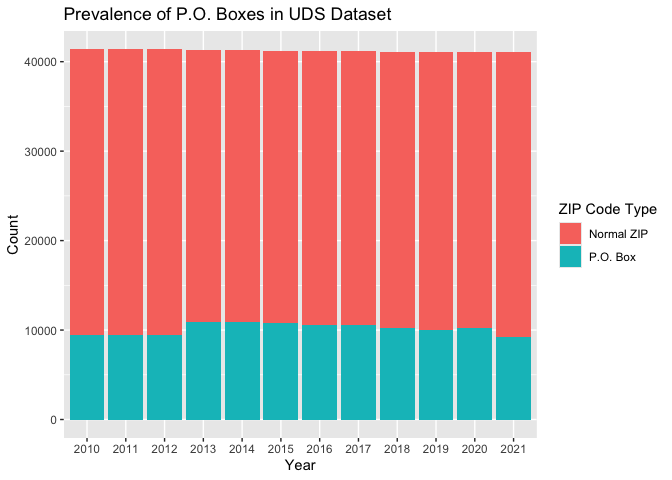
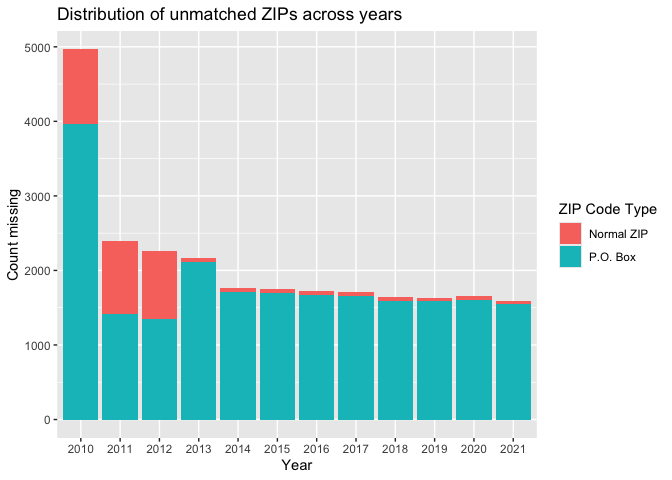

## R Markdown

This R markdown script explores the way HUD crosswalks deal with PO boxes in their ZIP --> FIPS crosswalks. In order to do this, we'll use the intermediate-stage UDS crosswalk files in NSAPH's ZIP --> ZCTA pipeline. This file, `data/intermediate/uds_clean_xwalk/uds_clean_xwalk.csv`, can be produced using the pipeline found at [this GitHub repo](https://github.com/NSAPH-Data-Processing/zip2fips_master_xwalk/tree/main). 


``` r
# loading UDS crosswalk
uds_xwalk <- read.csv("/Users/jck019/Desktop/nsaph/data_team/zip2zcta_master_xwalk/data/intermediate/uds_clean_xwalk/uds_clean_xwalk.csv", sep=";",
                      colClasses = c("zip" = "character", "zcta"="character")) %>%
  filter(year > 2009)

uds_xwalk$info[uds_xwalk$info == ""] <- NA

# loading zip --> fips crosswalk
hud_xwalk <- read.csv("/Users/jck019/Desktop/nsaph/data_team/zip-fips-crosswalk/data/output/zip2fips_master_xwalk_2010_2023.csv", 
                      colClasses = c("zip" = "character", 
                                     "fips" = "character"))[,-1] %>%
  filter(year <= 2021)


# merging the two data frames
hud_uds_mg <- uds_xwalk %>% select(-info) %>%
  merge(hud_xwalk, by=c("zip", "year"),all=T) %>%
  mutate(missing_fips = is.na(fips))

# zips that are unmatched in fips df
miss_fips <- hud_uds_mg %>% filter(is.na(fips))
```


We first confirm that the total number of ZIP codes, as well as the proportion of ZIP codes that are P.O. boxes, is relatively consistent across years.

``` r
# Overall dataset
ggplot(hud_uds_mg %>% filter(!is.na(zcta)), aes(x=as.factor(year), fill=is_post_office)) +
  geom_bar(stat="count") +
  xlab("Year") +
  ylab("Count") +
  scale_fill_discrete(name="ZIP Code Type", 
                      labels=c("False" = "Normal ZIP", "True" = "P.O. Box")) +
  ggtitle("Prevalence of P.O. Boxes in UDS Dataset")
```

<!-- -->


We then break down the type of the zip codes that are unmatched to a county after the crosswalk-building process.

``` r
ggplot(miss_fips, aes(x=as.factor(is_post_office), fill=is_post_office)) +
  geom_bar(stat="count")+
  scale_x_discrete(labels=c("False" = "Normal ZIP", "True" = "P.O. Box")) +
  xlab("ZIP Code Type") +
  ylab("Count missing") +
  guides(fill="none") +
  ggtitle("Missing ZIPs by P.O. Box Status")
```

<!-- -->

``` r
print((sum(miss_fips$is_post_office =="True")/nrow(miss_fips)) %>% round(digits=3))
```

```
## [1] 0.867
```

As shown in the plot above, the vast majority of ZIP codes that are unmatched to a FIPS code in the HUD crosswalks are P.O. boxes.


We'll now examine the distribution of missingness across years, and how this relates to P.O. box status.


``` r
ggplot(miss_fips, aes(x=as.factor(year), fill=is_post_office)) +
  geom_bar(stat="count") +
  xlab("Year") +
  ylab("Count missing") +
  scale_fill_discrete(name="ZIP Code Type", 
                      labels=c("False" = "Normal ZIP", "True" = "P.O. Box")) +
  ggtitle("Distribution of unmatched ZIPs across years")
```

<!-- -->

We observe a larger number of unmatched ZIPs from 2010-2013, driven in part by a larger number of unmatched "normal" ZIP codes (i.e. ZIP codes that are not P.O. boxes).


The increase in missingness from 2010-2013 raises some eyebrows, but as shown in the following figure it is still a very small percentage, roughly 5%, of total ZIP codes.

``` r
ggplot(hud_uds_mg %>% filter(!is.na(zcta)), aes(x=as.factor(year), fill=missing_fips)) +
  geom_bar(stat="count", color="black") +
  xlab("Year") +
  ylab("Count") +
  scale_fill_manual(name="Matched to FIPS", 
                      labels=c("FALSE" = "Yes", "TRUE" = "No"),
                    values=c("blue", "red")) +
  ggtitle("Number of unmatched ZIP codes across years")
```

<!-- -->

``` r
print((sum(hud_uds_mg$missing_fips)/nrow(hud_uds_mg)) %>% round(4))
```

```
## [1] 0.0511
```

