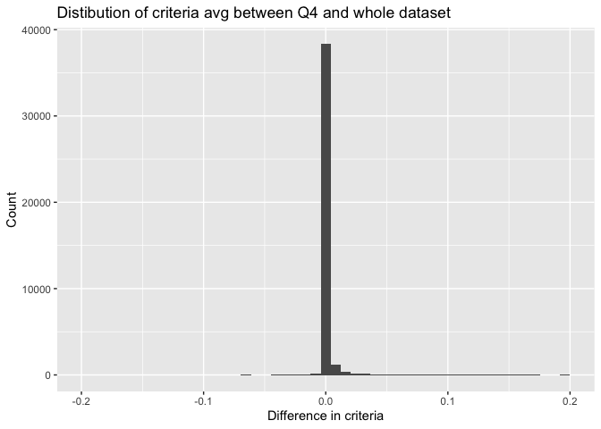

## Quarter inclusion?

We run a short sensitivity analysis to examine changes in the final crosswalk when input crosswalks from all quarters are used.

```r
# If we run just Q4 analysis, what changes? -------------------------------
library(data.table)
library(dplyr)
library(ggplot2)


# load full data frame
xwalk_full <- data.table::fread("../data/intermediate/zip2county_xwalk_clean_2010_2023.csv", 
                                colClasses = c(zip="character",
                                               county="character"))

# perform basic matching with just Q4 data
county_matches_q4 <- xwalk_full %>% 
  filter(quarter == 4) %>%
  group_by(zip, year) %>%
  slice_max(tot_ratio) %>%  
  ungroup() %>%
  group_by(zip, county) %>%
  summarize(min_year = min(year),
            max_year = max(year), 
            total_matches = n(),
            tot_ratio_min = min(tot_ratio),
            tot_ratio_max = max(tot_ratio),
            tot_ratio_mean = mean(tot_ratio))

# do matching with full dataset
county_matches_all <- xwalk_full %>%
  group_by(zip, year) %>%
  slice_max(tot_ratio) %>%  
  ungroup() %>%
  group_by(zip, county) %>%
  summarize(min_year = min(year),
            max_year = max(year), 
            total_matches = n(),
            tot_ratio_min = min(tot_ratio),
            tot_ratio_max = max(tot_ratio),
            tot_ratio_mean = mean(tot_ratio))

county_matches_q4$match_str <- paste0(county_matches_q4$zip, ",", county_matches_q4$county)
county_matches_all$match_str <- paste0(county_matches_all$zip, ",", county_matches_all$county)

# what fraction of zip/county matches are NOT in the q4 dataset?
print(sum(!unique(county_matches_all$match_str) %in% 
      unique(county_matches_q4$match_str))/length(unique(county_matches_all$match_str)))
```

```
## [1] 0.0009296636
```

```r
# raw number
print(sum(!unique(county_matches_all$match_str) %in% 
      unique(county_matches_q4$match_str)))
```

```
## [1] 38
```

The above code chunk calculates the total number of total zip/county matches that are in the quarterly crosswalks but not in the yearly-compiled crosswalks. There are just 0.09% missing! Only 38 out of nearly 40,000 unique zip codes.


We now run an analysis to tell if there is a noticeable change in criteria averages if we use Q4 vs the whole dataset. Note that these matches are not exactly the same as would be produced by the pipeline, but they are close enough for a quick comparison.

```r
# now comparing criteria means between the two groups
county_matches_all_mg <- county_matches_all %>%
  merge(county_matches_q4 %>% select(zip, county, tot_ratio_mean),
        by=c("zip", "county"),
        suffixes=c(".all", ".q4")) %>%
  mutate(criteria_diff = tot_ratio_mean.all - tot_ratio_mean.q4)

ggplot(county_matches_all_mg, aes(x=criteria_diff)) +
  geom_histogram(bins=50) +
  xlab("Difference in criteria") +
  ylab("Count") +
  xlim(c(-0.2, 0.2)) +
  ggtitle("Distibution of criteria avg between Q4 and whole dataset")
```

<!-- -->

```r
# summary statistics
print(paste0("Mean difference: ", mean(county_matches_all_mg$criteria_diff)))
```

```
## [1] "Mean difference: 0.00137617393789681"
```

```r
print(paste0("SD difference: ", sd(county_matches_all_mg$criteria_diff)))
```

```
## [1] "SD difference: 0.00844233996447902"
```

```r
print(quantile(county_matches_all_mg$criteria_diff, c(0.025, 0.5, 0.975)) %>% round(5))
```

```
##     2.5%      50%    97.5% 
## -0.00008  0.00000  0.01355
```


