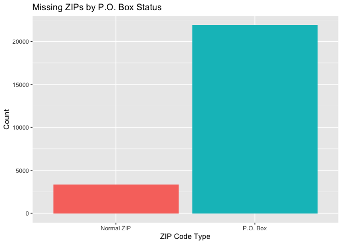
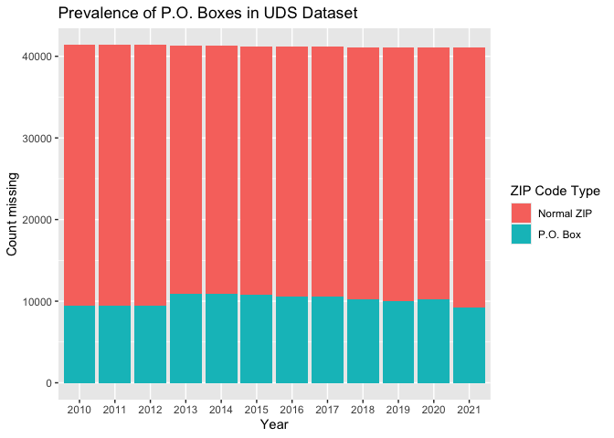
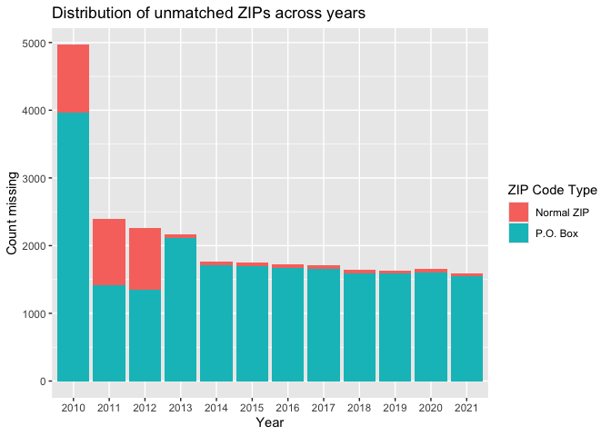
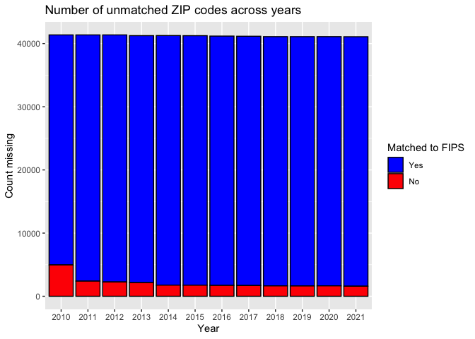

## R Markdown

This R markdown script explores the way HUD crosswalks deal with PO boxes in their ZIP --> FIPS crosswalks. In order to do this, we'll use the intermediate-stage UDS crosswalk files in NSAPH's ZIP --> ZCTA pipeline. This file, `data/intermediate/uds_clean_xwalk/uds_clean_xwalk.csv`, can be produced using the pipeline found at [this GitHub repo](https://github.com/NSAPH-Data-Processing/zip2fips_master_xwalk/tree/main). 


``` r
# loading UDS crosswalk
uds_xwalk <- read.csv("/Users/jck019/Desktop/nsaph/data_team/zip2zcta_master_xwalk/data/intermediate/uds_clean_xwalk/uds_clean_xwalk.csv", sep=";",
                      colClasses = c("zip" = "character", "zcta"="character")) %>%
  filter(year > 2009)

uds_xwalk$info[uds_xwalk$info == ""] <- NA

# loading zip --> fips crosswalk
hud_xwalk <- read.csv("/Users/jck019/Desktop/nsaph/data_team/zip-fips-crosswalk/data/output/zip2fips_master_xwalk_2010_2023.csv", 
                      colClasses = c("zip" = "character", 
                                     "fips" = "character"))[,-1] %>%
  filter(year <= 2021)


# merging the two data frames
hud_uds_mg <- uds_xwalk %>% select(-info) %>%
  merge(hud_xwalk, by=c("zip", "year"),all=T) %>%
  mutate(missing_fips = is.na(fips))

# zips that are unmatched in fips df
miss_fips <- hud_uds_mg %>% filter(is.na(fips))

ggplot(miss_fips, aes(x=as.factor(is_post_office), fill=is_post_office)) +
  geom_bar(stat="count")+
  scale_x_discrete(labels=c("False" = "Normal ZIP", "True" = "P.O. Box")) +
  xlab("ZIP Code Type") +
  ylab("Count") +
  guides(fill="none") +
  ggtitle("Missing ZIPs by P.O. Box Status")
```

<!-- -->

``` r
print((sum(miss_fips$is_post_office =="True")/nrow(miss_fips)) %>% round(digits=3))
```

```
## [1] 0.867
```

As shown in the plot above, the vast majority of ZIP codes that are unmatched to a FIPS code in the HUD crosswalks are P.O. boxes. This makes sense, since many P.O. boxes may just be attached to businesses.


We also confirm that the total number of ZIP codes, as well as the proportion of ZIP codes that are P.O. boxes, is relatively consistent across years.

``` r
# Overall dataset
ggplot(hud_uds_mg %>% filter(!is.na(zcta)), aes(x=as.factor(year), fill=is_post_office)) +
  geom_bar(stat="count") +
  xlab("Year") +
  ylab("Count missing") +
  scale_fill_discrete(name="ZIP Code Type", 
                      labels=c("False" = "Normal ZIP", "True" = "P.O. Box")) +
  ggtitle("Prevalence of P.O. Boxes in UDS Dataset")
```

<!-- -->


We'll now examine the distribution of missingness across years, and how this relates to P.O. box status.


``` r
ggplot(miss_fips, aes(x=as.factor(year), fill=is_post_office)) +
  geom_bar(stat="count") +
  xlab("Year") +
  ylab("Count missing") +
  scale_fill_discrete(name="ZIP Code Type", 
                      labels=c("False" = "Normal ZIP", "True" = "P.O. Box")) +
  ggtitle("Distribution of unmatched ZIPs across years")
```

<!-- -->

We observe a larger number of unmatched ZIPs from 2010-2013, driven in part by a larger number of unmatched "normal" ZIP codes (i.e. ZIP codes that are not P.O. boxes).


The increase in missingness from 2010-2013 raises some eyebrows, but as shown in the following figure it is still a very small percentage, roughly 5%, of total ZIP codes.

``` r
ggplot(hud_uds_mg %>% filter(!is.na(zcta)), aes(x=as.factor(year), fill=missing_fips)) +
  geom_bar(stat="count", color="black") +
  xlab("Year") +
  ylab("Count missing") +
  scale_fill_manual(name="Matched to FIPS", 
                      labels=c("FALSE" = "Yes", "TRUE" = "No"),
                    values=c("blue", "red")) +
  ggtitle("Number of unmatched ZIP codes across years")
```

<!-- -->

``` r
print((sum(hud_uds_mg$missing_fips)/nrow(hud_uds_mg)) %>% round(4))
```

```
## [1] 0.0511
```

